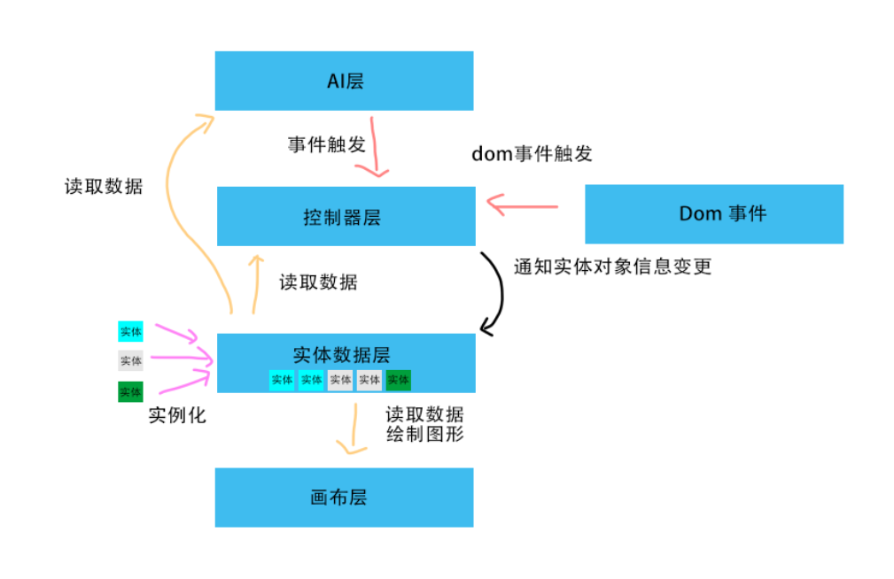

1. 画布层  用来控制绘图\
```javascript
  class DavinciCanvas {
    drawList: {
      "tank0": {}
    },
    init() {
      this.drawList["tank0"] = new Tank();
    }
    draw() {}
  }

```

3. 控制器层 用来做各种约束
```javascript
  class DavinciCanvas {
    drawList: {
      "tank0": {}
    },
    init() {
      this.drawList["tank0"] = new Tank();
    }
    draw() {}
  }

```

4. 实体层 描述各种实体
```javascript
  class Tank {
    position: [0,0],
    // 0 left, 1 right, 2 up, 3 down
    forward: 1,
    // 获取边界
    getBorder() {}
    
  }

```




init =》 载入预设实体 =》 绘制新的实体 =》 启动自循环AI(不是) =》 申请位置更新 =》 控制器设定是否接受并更新实体数据 =》 绘制新的实体

dom操作 =》 申请位置更新 =》 控制器设定是否接受并更新实体数据 =》 绘制新的实体


## 初始化：
1. 载入config
2. 实例化对象
3. 实例化完毕
4. 通知画布更新


## AI（实例化后）
1. 读取数据
2. 得出最优解
3. 触发控制器


## dom操作
1. 递交控制器
2. 读取Data并交给逻辑模块判断，返回新内容
3. 通知实体数据更新
4. 通知画布更新